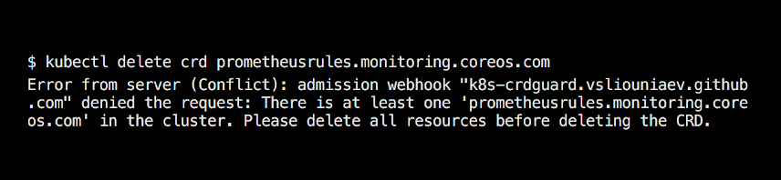

[](https://goreportcard.com/report/github.com/vsliouniaev/k8s-crdguard)
[](https://github.com/vsliouniaev/k8s-crdguard/releases/latest)
[](https://hub.docker.com/r/vsliouniaev/k8s-crdguard/tags)

# k8s-crdguard



Uses [jet/kube-webhook-certgen](https://github.com/jet/kube-webhook-certgen) in the provided chart 
to simplify provisioning certificates for `validatingwebhookconfigurations`.

```sh
Usage of k8s-crdguard:
  -cert-file string
    	Path to certificate file to serve TLS. (default "/cert/cert")
  -crds value
    	List of crds to block deletion of. Default will block all CRDs. (example "prometheuses.monitoring.coreos.com")
  -key-file string
    	Path to key file to serve TLS. (default "/cert/key")
  -kubeconfig string
    	Path to kubeconfig file: e.g. ~/.kube/kind-config-kind. (default uses in-cluster config)
  -log-debug
    	Whether to enable debug log configuration. (default false)
```
